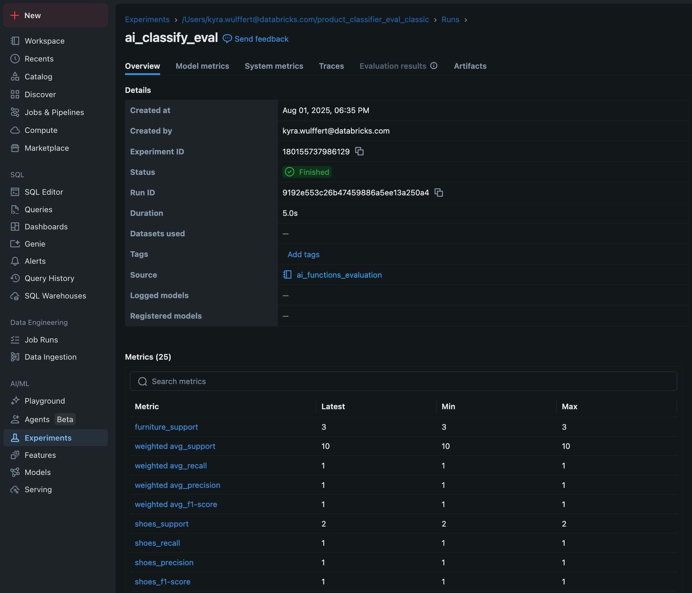
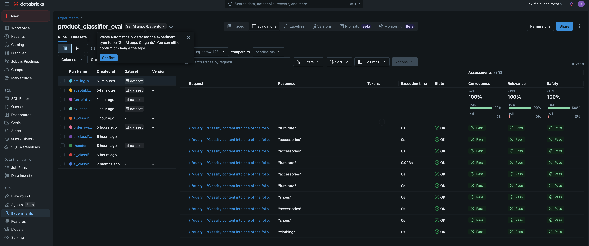

# AI Functions Evaluation

A minimal example that shows how to **classify product descriptions** with Databricks SQL AI functions and then **evaluate** those predictions in MLflow, including the new `mlflow.genai` semantic scorers.

---

\## Project overview

| File                         | Purpose                                                    |
| ---------------------------- | ---------------------------------------------------------- |
| `ai_functions_evaluation.py` | Databricks notebook / demo for classification use case     |
| `ai_summarize_evaluation.py` | Databricks notebook / demo for summarization use case      |
| `README.md`                  |                                                            |

---

\## Quick start

1. **Clone the repo**
   ```bash
   git clone https://github.com/kwulffert23/ai_functions_evaluation.git
   cd ai_functions_evaluation
   ```
2. **Install the few Python deps** (outside Databricks):
   ```bash
   pip install mlflow databricks-agents scikit-learn pandas
   ```
3. **Open **`` in Databricks and run all cells, or execute it locally with the Databricks CLI configured.

The script will:

- call `ai_classify()` to label each product description;
- compute classic classification metrics in SQL;
- log a scikit‑learn report to MLflow; and
- run `mlflow.genai.evaluate()` with scorers such as **Correctness**, **RelevanceToQuery**, and **Safety**.

---

\## MLflow3 Evaluation

\###Example of Classic ML evaluation 


\###Example of GenAI evaluation 

```

